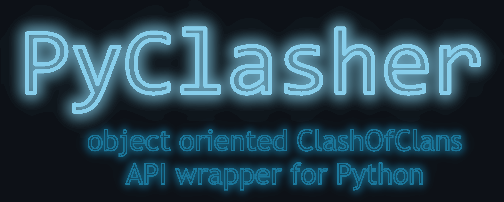

[![Discord][discord_shield]][discord_url] ![Last commit][last_commit_shield]



# PyClasher

PyClasher is the name of the asynchronous ClashOfClans API. It is
an object-oriented wrapper client that provides easy access to the 
requested data.

---

I am planning to release the package on pypi.org after my exams. This is 
probably in the first week of september.

The package is still in development and will be finished as short as
possible for me. When the package covers the whole ClashOfClans API, the 
repository will be transformed into a python package and will be available for 
everyone. 

If you have any questions, feel free to join my discord server to ask your 
question. 

## Installation

It is possible to install the package from GitHib releases. You can use the 
following command to add PyClasher to your library:
```bash
pip install git+https://github.com/201st-Luka/PyClasher.git@v1.0.0-alpha1
```

---

## Features
 - Asynchronous and parallel requesting
 - Possibility to use multiple tokens and to login via email address and 
password of the ClashOfClans developer portal
 - Control over the number of requests per second and the number of used tokens
 - Open source
 - Type hinted
 - Sopports Python 3.8 -> 3.11

---

## Contributing

Feel free to contribute to the repository. 

You can fork the repository and commit your changes in a pull request. Please 
consider to check out the [Discord server][discord_url] if so.

---

## Future

I'm planning to keep the API wrapper up to date and improve it as good as I can. 

### Planned features

- more bulk requests
- pytests for the models
- events

### Planned utils

- documentation
- real example ([HeadhunterBot][headhunterbot_url] is in development)

### Planned code implementations (ToDo-list)

- attributes `king`, `queen`, `warden`, `royal_champion` for the 
`Player.heroes` attribute
- events and an `EventClient`

---

If you find a bug, an error or want custom functionality, please tell me via 
Discord or open an issue or start a discussion on the GitHub-repository.

---

##### Disclaimer
This material is unofficial and is not endorsed by Supercell. For more 
information see Supercell's Fan Content Policy:
www.supercell.com/fan-content-policy.


<!---links--->
[discord_shield]: https://img.shields.io/badge/Discord-blue?logo=discord&logoColor=white
[discord_url]: https://discord.gg/j2PAF9Wru8
[last_commit_shield]: https://img.shields.io/github/last-commit/201st-Luka/HeadhunterBot
[headhunterbot_url]: https://github.com/201st-Luka/HeadhunterBot
